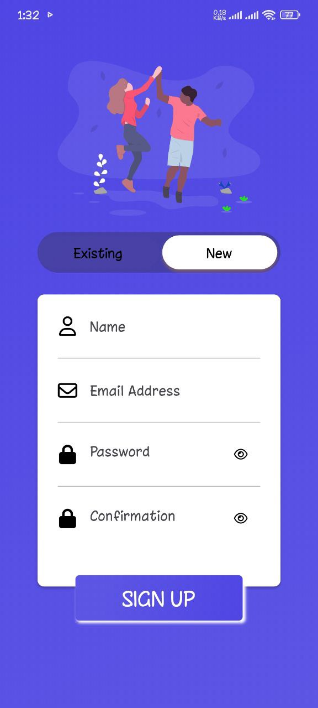
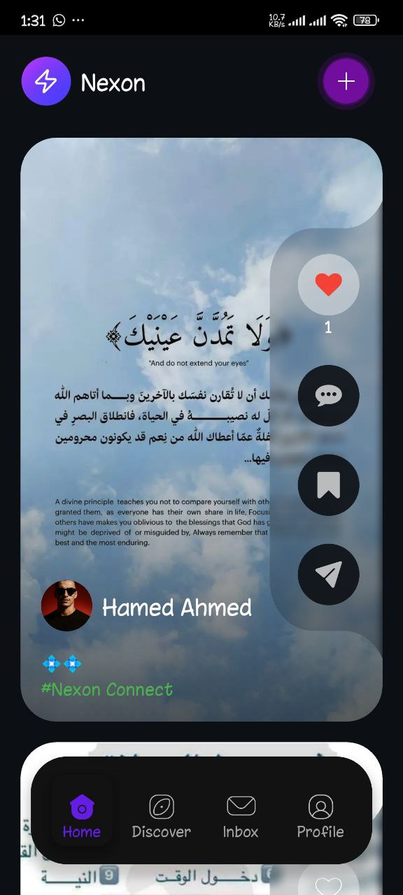
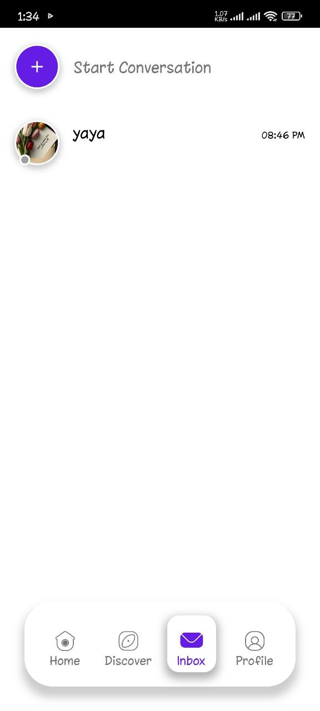
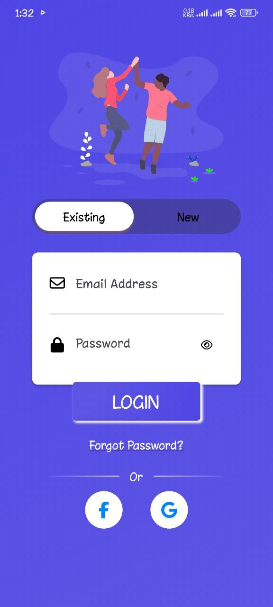
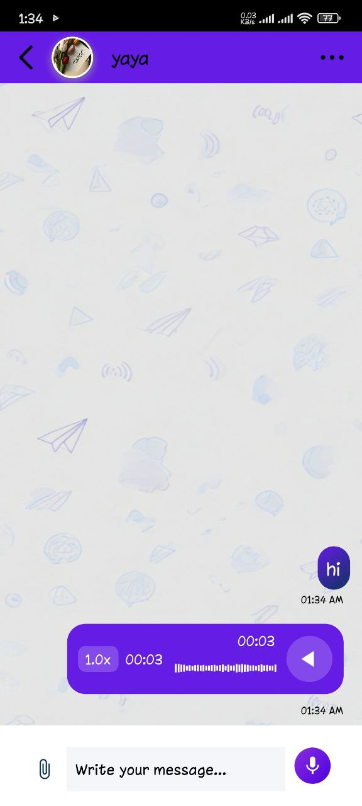
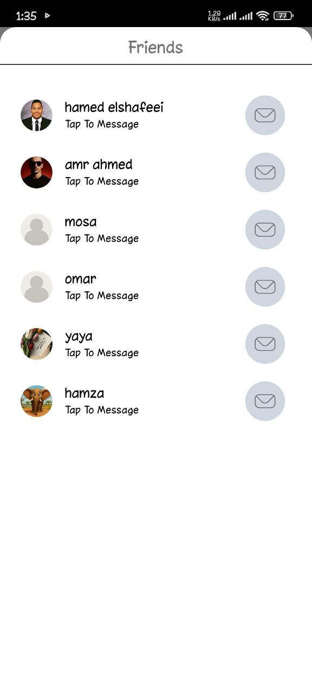
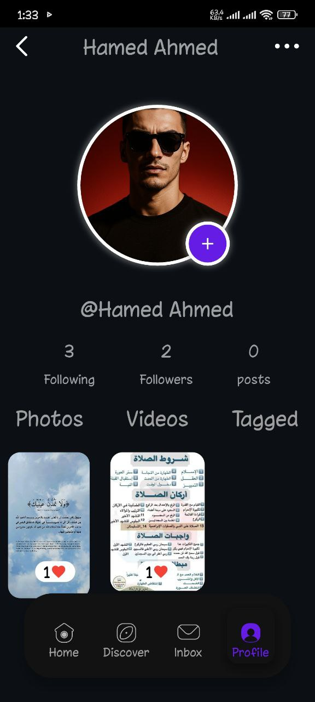
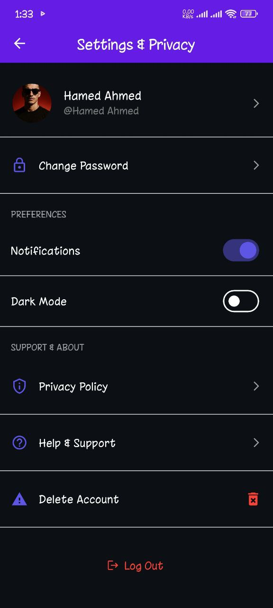
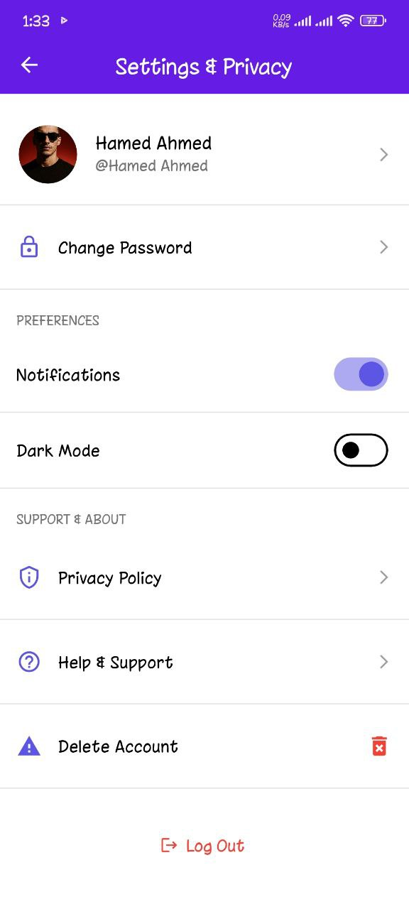
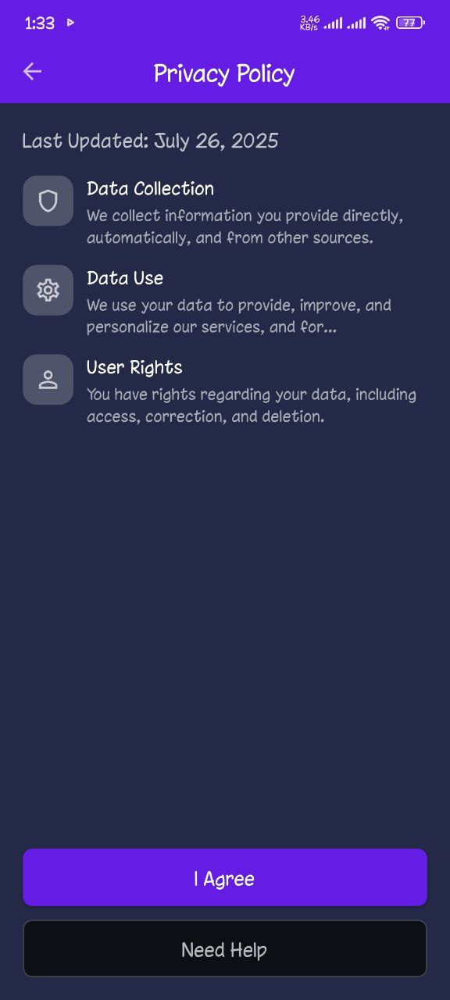

<div align="center">
  
  <h1>Nexon Connect</h1>
  <p>A powerful real-time social media (Instagram clone) Flutter app with Firebase & Supabase</p>
</div>

---

## 📚 Table of Contents

- [📱 About the Project](#-about-the-project)
- [🧪 Features](#-features)
- [📸 Screenshots](#-screenshots)
- [🚀 Tech Stack](#-tech-stack)
- [🛠️ Getting Started](#️-getting-started)
- [🎯 Usage](#-usage)
- [✨ Coming Soon](#-coming-soon)
- [🤝 Contributing](#-contributing)
- [📄 License](#-license)

---

## 📱 About the Project

**Nexon Connect** is a modern, feature-rich social app built using **Flutter**, supporting real-time interaction with **Firebase**, media storage with **Supabase**, and state management via **Bloc/Cubit**.

Users can:

- Register & log in
- Post content (with images)
- Comment & like posts
- Chat with friends (inbox)
- See real-time online presence
- Receive push notifications
- Switch between light/dark modes
- Record and send voice messages
- Follow/unfollow users & see followers

---

## 🧪 Features

| Feature                               | Description                                            |
| ------------------------------------- | ------------------------------------------------------ |
| 🔐 Firebase Auth                      | Email/Password-based sign-in and sign-up               |
| 🖼️ Post System                        | Upload text and image posts using Supabase             |
| 💬 Comments & Likes                   | Real-time interaction on posts                         |
| 🧑‍🤝‍🧑 Follow System                      | Follow/unfollow users & see followers                  |
| 🔔 Notifications                      | FCM + Local notifications for likes, comments, follows |
| 🟢 Online Presence                    | Track online/offline status using Firestore            |
| 📤 Inbox & Messaging                  | Send & receive messages, unread count, timestamps      |
| 🎙️ Voice Recorder (NEW)               | Record and send voice messages in chat                 |
| 🌙 Dark / Light Mode (NEW)            | Toggle app themes from Settings                        |
| ⚙️ Settings Page (NEW)                | Customize preferences like theme and notifications     |
| 🔄 Foreground/Background Notifs (NEW) | Full push notification support                         |

---
## 📸 Screenshots

| **Login**                          | **Home**                          | **Post**                          | **Chat**                          |
|------------------------------------|-----------------------------------|-----------------------------------|-----------------------------------|
|  |   |  |  |
|  |  |  |  |
|  |                                   |                                   |                                   |

| **Discover**                      | **Friends**                       | **Profile**                       | **Settings**                      |
|-----------------------------------|-----------------------------------|-----------------------------------|-----------------------------------|
|  |  |  |  |
|  |                                   |                                   |  |
|                                   |                                   |                                   |  |
|                                   |                                   |                                   |  |
|                                   |                                   |                                   |  |
---

## 🚀 Tech Stack

- **Flutter** (v3.22+)
- **Firebase** (Auth, Firestore, Cloud Messaging)
- **Supabase** (Image storage)
- **Bloc / Cubit** (State management)
- **flutter_local_notifications**
- **voice_note_kit**
- **shared_preferences**
- **googleapis_auth**
- **http**
- **image_picker**
- **intl**
- **lottie**
- **permission_handler**
- **skeletonizer**

---

## 🛠️ Getting Started

To run this project locally, follow these steps:

1. Clone the repository
2. Install dependencies
3. Set up Firebase and Supabase
4. Run the app

### ⚙️ Installation

```bash
git clone https://github.com/hamed12232/Nexon-Connect.git
cd Nexon-Connect
flutter pub get
```
